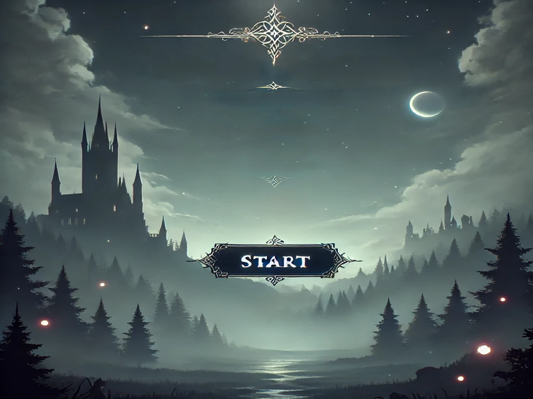

# The Lost Hero

## Descrição
The Lost Hero é um jogo RPG 2D em Java com sistema de combate por turnos, desenvolvido usando Java Swing.

## Características
- Interface gráfica 2D
- Sistema de movimento com teclas WASD
- Boss battle (Goblin) com sistema de combate por turnos
- NPC interativo (Rimuru)
- Sistema completo de recursos para execução standalone

## Como Jogar

### Opção 1: Executar JAR (Mais Fácil)
**Pré-requisito:** Java 11+ instalado

```bash
java -jar the-lost-hero.jar
```

### Opção 2: Compilar do Código Fonte
**Pré-requisitos:** JDK 11+ instalado

```bash
# Compilar
javac -d out -cp src src/*.java src/io/github/jiangdequan/*.java

# Copiar recursos
cp -r resources out/  # Linux/Mac
xcopy /s /e /y resources out\resources\  # Windows

# Executar
java -cp out Main
```

## Controles
- **WASD** - Movimento do jogador
- **Mouse** - Interação com interface (botões)
- **Espaço** - Confirmar ações no combate

## Screenshots


## Recursos do Jogo
- [x] Tela inicial funcional
- [x] Movimento do jogador
- [x] Sistema de colisão
- [x] Boss battle (Goblin)
- [x] Sistema de combate por turnos
- [x] NPC interativo (Rimuru)
- [x] Sistema completo de recursos

## Tecnologias Utilizadas
- **Java** - Linguagem principal
- **Java Swing** - Interface gráfica
- **BufferedImage** - Manipulação de imagens
- **Threading** - Loop principal do jogo

## Estrutura do Projeto
```
src/                    # Código fonte
├── Main.java          # Classe principal
├── TelaInicial.java   # Tela inicial
├── GamePainel.java    # Engine principal do jogo
├── Boss.java          # Boss Goblin
├── CombateSystem.java # Sistema de batalha
├── NpcPixelArtDev.java # NPC Rimuru
├── TileManager.java   # Gerenciador do mapa
└── io/github/jiangdequan/
    └── KeyHandler.java # Controles

resources/              # Recursos do jogo
├── Cenarios/          # Mapas
├── Inimigos/          # Sprites de inimigos
├── Interface/         # UI
├── Npcs/             # Sprites de NPCs
└── Player/           # Sprites do jogador

the-lost-hero.jar      # Executável pronto para uso
```

## Desenvolvimento
Este projeto foi desenvolvido como um exemplo de jogo 2D em Java, demonstrando:
- Arquitetura de jogo com loop principal
- Sistema de estados (menu → jogo → batalha)
- Carregamento de recursos
- Sistema de combate por turnos
- Interação jogador-NPC

## Licença
Este projeto é disponibilizado sob licença MIT - veja LICENSE para detalhes.
